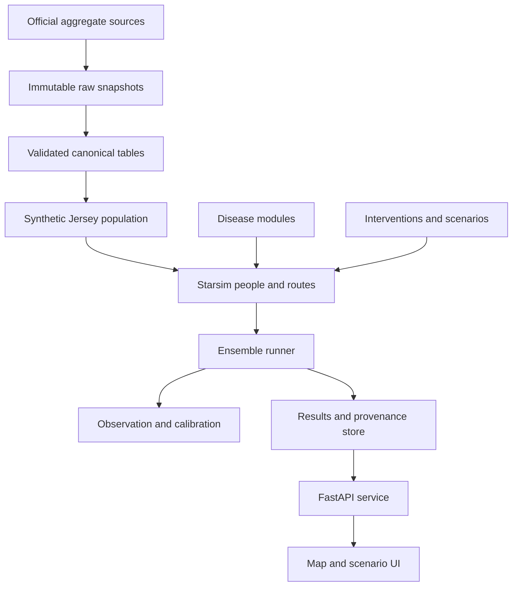
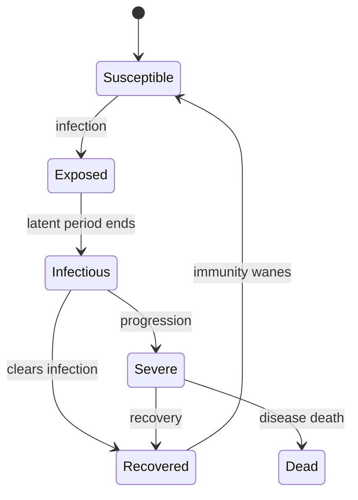

# Jersey Outbreak Simulator

## Codex-ready project charter, architecture and implementation plan

**Working title:** Jersey Outbreak Simulator (JOS)  
**Status (2026-09-01):** this charter is the ORIGINAL 25 Aug plan, kept for history — **superseded**. V1.0 released (`jos-v1.0.0`), **V1.1 released (`jos-v1.1.0`)**; current state, next actions and the V1.2→V2 roadmap authority live in `.claude/FRONTIER.md` on branch `docs/frontier`.  
**Original status text:** Implementation through M6 complete; C1, C2, C3 and C4 corrective
closures PASS; M7 CLOSED
**Prepared:** 25 August 2026  
**Primary engine:** Starsim 3.5.2 or the latest verified compatible 3.5.x release  
**Initial disease family:** Human respiratory infection  
**Geography:** Jersey, Channel Islands  
**Development approach:** Local-first, open-source, synthetic population, milestone-gated  

---

## 1. Project in one paragraph

Build a scientifically defensible, visually compelling agent-based simulator of infectious-disease spread through Jersey. The simulator will create a wholly synthetic population matching Jersey's aggregate demography and habits, place synthetic residents into households, schools, workplaces, care settings and parishes, move them through realistic daily contact layers, and run disease-specific transmission and intervention scenarios using Starsim. The first complete model will be a respiratory SEIRS-style infection. The architecture must later accommodate measles-like infections, food/waterborne transmission, vector-borne disease, sexual/bloodborne transmission and zoonotic spillover without rewriting the population, scenario, provenance or results systems.

This is achievable as a strong research prototype in roughly a week of concentrated AI-assisted development. It will not become a validated public-health forecasting system merely because the code runs. Scientific validation, parameter inference and comparison with real outbreaks are separate workstreams and must be described honestly.

### Current implementation status

As of 27 August 2026, M0–M6 are implemented and verified, with the C1
employment/population closure, C2 network-semantics closure and C3
observation/verification closure all passing. C4 is a bounded correction to
runtime detection and ensemble semantics. M7 remains deliberately closed:
interventions have not been implemented. The current commit, gate evidence,
hashes, benchmarks and limitations are maintained in
[`docs/progress.md`](docs/progress.md).

---

## 2. Product goals

### 2.1 Primary goals

1. Represent Jersey as a real contact system rather than a homogeneous population.
2. Generate approximately 104,540 synthetic residents from official aggregate statistics.
3. Represent households, schools, workplaces, commuting, community activity, care homes and imported infections.
4. Simulate route-specific disease transmission using Starsim's agent, module and route abstractions.
5. Compare interventions such as vaccination, isolation, school closure, working from home, reduced hospitality mixing and travel controls.
6. Display spread over time by parish, setting, age and disease state.
7. Run stochastic ensembles and display uncertainty rather than a single authoritative curve.
8. Preserve every important data source, transformation, parameter assumption and random seed.
9. Make additional transmission families pluggable at stable boundaries.
10. Produce a portfolio-quality demonstration with tests, documentation and reproducible example scenarios.

### 2.2 Intended users

- The developer/researcher exploring epidemiological scenarios.
- Students and interested members of the public using clearly labelled educational scenarios.
- Potential future research collaborators reviewing methods and assumptions.

### 2.3 Explicit non-goals for the first release

- Predicting the date or size of the next Jersey outbreak.
- Claiming clinical or policy authority.
- Using identifiable resident, patient, school-pupil or mobility data.
- Simulating individual residents at their real addresses.
- Modelling every hour, building or venue on the Island.
- Supporting every transmission family before the respiratory model is validated.
- Producing precise hospital forecasts before Jersey-specific clinical parameters and capacity data are sourced.
- Hiding uncertainty behind an attractive animation.

---

## 3. Scientific principles

These are project rules, not optional refinements.

1. **Synthetic people only.** Use aggregate official data to generate statistically similar fictional residents.
2. **Separate mechanisms.** Population, contact behaviour, disease biology, interventions and observations must remain separate modules.
3. **Separate truth from observation.** True infections are not reported cases. Testing, reporting delay and ascertainment belong in an observation model.
4. **Separate measured from assumed.** Every input is labelled with its actual
   provenance, including `observed`, `derived`, `literature_prior`,
   `calibrated`, `regulatory_minimum`, `synthetic`,
   `structural_assumption` or `unknown` where applicable.
5. **No fake precision.** Parish-level evidence must not be presented as exact household or GPS-level knowledge.
6. **Stochastic outputs require ensembles.** Default comparisons use repeated seeded runs and uncertainty intervals.
7. **Calibration is not validation.** Fitting one epidemic curve does not prove the model's mechanisms are correct.
8. **Beware identifiability.** Transmission probability, contact frequency and case ascertainment can compensate for one another. Use defensible priors and do not freely tune everything.
9. **Route attribution matters.** Household, school, workplace, transport, care and community transmission must be independently measurable.
10. **Reproducibility is a feature.** Code version, data snapshot, configuration, seed and dependency lock must reconstruct a result.
11. **Model claims must be bounded.** The UI and documentation must distinguish demonstration, calibrated reconstruction and prospective forecast.

---

## 4. Why Starsim

Starsim is an open-source Python framework for agent-based disease modelling through dynamic transmission networks. It supports custom diseases, networks/routes, demographics, interventions, analyzers, connectors, multiple diseases, scenario analysis and Optuna-based calibration. Its module lifecycle aligns with this project's need to keep Jersey population behaviour independent from disease biology.

Use the official abstractions rather than building a second simulation engine:

| Starsim concept | JOS responsibility |
|---|---|
| `ss.Sim` | Time, module orchestration, run lifecycle and base results |
| `ss.People` and states | Synthetic-resident state arrays |
| `ss.Network` / `ss.Route` | Household, school, work, care, transport and community exposure routes |
| `ss.Infection` / `ss.Disease` | Disease natural history and transmission |
| `ss.Intervention` | Vaccination, isolation, closures, behaviour changes and travel controls |
| `ss.Analyzer` | Route attribution, parish summaries, prevalence, incidence and validation metrics |
| `ss.Connector` | Cross-module interactions where direct coupling is unavoidable |
| Starsim calibration | Optuna-driven fitting with explicit likelihood components and held-out checks |

Relevant official documentation:

- [Starsim documentation](https://docs.starsim.org/)
- [Starsim GitHub repository](https://github.com/starsimhub/starsim)
- [Adding custom modules](https://docs.starsim.org/user_guide/modules_adding.html)
- [Networks and transmission routes](https://docs.starsim.org/user_guide/modules_networks.html)
- [Optuna calibration workflow](https://docs.starsim.org/user_guide/workflows_calibration.html)

Pin an exact Starsim version in the lock file. Before implementing custom modules, Codex must inspect the installed version's API and run a minimal example. Do not write against remembered or older APIs.

---

## 5. Jersey evidence baseline

### 5.1 Evidence policy

The repository will include a machine-readable source registry. Each record should contain:

```yaml
source_id: jersey_population_2024
title: Population
publisher: Statistics Jersey
url: https://stats.je/statistic/population/
retrieved_at: 2026-08-25
reference_period: "2024-12-31"
license: Open Government Licence - Jersey, where applicable
status: official
local_snapshot: data/raw/jersey_population_2024/...
sha256: "..."
notes: "Latest official population estimate at project specification date"
```

Raw source snapshots are immutable. Derived tables are generated by code and never manually edited.

### 5.2 Population

The latest official estimate available at specification time is **104,540 residents at the end of 2024**. The population increased by 510 during 2024: net migration was +670 and natural change was -150. Use 104,540 as the initial full-population target until a newer official estimate is released.

Source: [Statistics Jersey population estimates](https://stats.je/statistic/population/)

The detailed spatial distribution comes from the 2021 Census:

| Parish | 2021 residents | Density per km² |
|---|---:|---:|
| St Helier | 35,822 | 3,716 |
| St Saviour | 13,904 | 1,498 |
| St Brelade | 11,012 | 830 |
| St Clement | 9,925 | 2,262 |
| St Lawrence | 5,561 | 566 |
| Grouville | 5,401 | 658 |
| St Peter | 5,264 | 448 |
| St Ouen | 4,206 | 274 |
| St Martin | 3,948 | 384 |
| Trinity | 3,355 | 267 |
| St John | 3,051 | 332 |
| St Mary | 1,818 | 277 |

Until updated parish estimates are available, scale these shares to the 2024 total. Record that as a derived assumption; do not pretend each parish grew uniformly.

Source: [2021 Jersey Census report](https://www.statesassembly.je/publications/assembly-reports/2023/r-45-2023)

### 5.3 Age structure

Use detailed five-year age bands when ingested. The broad 2021 controls are:

| Age group | Residents | Share |
|---|---:|---:|
| 0-15 | 16,476 | 16% |
| 16-64 | 68,055 | 66% |
| 65+ | 18,736 | 18% |

The age structure has continued to age since the census. The 2024 population page reports that 55-59 was the largest five-year group and that the number aged over 64 grew 12% between 2019 and 2024. The generator should therefore rake to the downloadable 2024 age-by-sex data once it is ingested, while retaining the census for parish and household relationships.

### 5.4 Households and housing

The 2021 Census recorded 44,583 occupied private households containing 101,188 people, an average of 2.27 people per household. St Helier averaged 2.02 people per household, while several rural parishes were close to 2.5.

Important household controls:

| Household type | Count | Share |
|---|---:|---:|
| Single adult | 8,603 | 19% |
| Adult couple | 6,884 | 15% |
| Single parent with dependent children | 1,703 | 4% |
| Single parent, all children 16+ | 1,983 | 4% |
| Couple with dependent children | 7,887 | 18% |
| Couple, all children 16+ | 3,614 | 8% |
| Couple with one pensioner | 1,331 | 3% |
| Single pensioner | 5,463 | 12% |
| Two or more pensioners | 4,135 | 9% |
| Two or more unrelated people | 789 | 2% |
| Other | 2,191 | 5% |

Housing controls:

- 45% of occupied dwellings were flats.
- St Helier contained 17,411 occupied dwellings and averaged 1.91 bedrooms.
- 4% of all households were overcrowded by the Bedroom Standard.
- Overcrowding reached 14.6% in non-qualified accommodation.
- 16% of households had no car; in St Helier this was 30%.

Source: [Statistics Jersey households and dwellings](https://stats.je/statistic/households-and-dwellings-census-2021/)

Do not use nationality or ethnicity as a biological transmission multiplier. Housing, occupation, age, household structure and access to services may affect exposure and outcomes and can be modelled directly.

### 5.5 Employment and St Helier's daytime population

The 2021 Census recorded 57,338 working adults. Of workers with a workplace destination:

- 66% worked in St Helier.
- 13% worked in the semi-urban parishes.
- 21% worked in rural parishes.

Applying 66% to the census workforce gives an approximate **37,800 workers in St Helier**. Treat this as a derived order-of-magnitude because the report publishes the proportion rather than a direct St Helier count. Only 35% of residents lived in St Helier, so weekday inflow is a core feature of the model.

The June 2025 labour-market release recorded 65,320 jobs and the December release recorded 64,680. These are filled jobs, not unique workers; people with more than one job are counted more than once. June normally includes more seasonal employment.

June 2025 sector controls:

| Sector | Jobs | Approx. share |
|---|---:|---:|
| Financial and legal | 13,900 | 21% |
| Public sector | 9,940 | 15% |
| Private education, health and other services | 9,360 | 14% |
| Wholesale and retail | 6,780 | 10% |
| Miscellaneous business | 6,330 | 10% |
| Construction and quarrying | 6,130 | 9% |
| Hotels, restaurants and bars | 6,020 | 9% |
| Transport and storage | 2,160 | 3% |
| Remaining sectors | approximately 4,700 | approximately 7% |

Workplace-size controls:

- 8,500 active private-sector undertakings.
- 5,020 single-person undertakings.
- 89% employed fewer than ten people.
- Approximately 190 employed 50 or more.
- 76% of jobs were full-time, 14% mainly part-time and 10% zero-hours.
- The 2021 Census found approximately 7% of workers held an additional job.

Source: [Statistics Jersey Labour Market June 2025](https://stats.je/wp-content/uploads/2025/10/R-Labour-Market-June-2025-SJ20251031.pdf)

This requires a heavy-tailed workplace-size distribution. Do not place all workers into uniform 20-person workplaces.

### 5.6 Commuting and car access

The 2021 commuting counts were:

| Mode | Workers | Share |
|---|---:|---:|
| Car alone | 22,933 | 40% |
| Car driver with passenger | 3,694 | 6% |
| Car passenger | 3,060 | 5% |
| Walk | 13,202 | 23% |
| Bus | 2,312 | 4% |
| Cycle/e-bike | 2,391 | 4% |
| Motorcycle/scooter | 1,593 | 3% |
| Work from home | 7,837 | 14% |
| Other | 316 | 1% |

The census occurred during COVID work-from-home guidance, so 14% is not an unquestioned current baseline. Use it as a documented scenario range until current hybrid-working data are sourced.

Spatial differences are more robust:

- 69% of people who lived and worked in St Helier walked; 24% used a car.
- 75% of rural residents working in town travelled by car, 9% cycled and 8% used a bus.
- The 2025 lifestyle survey found 72% of St Helier workers walked or cycled to work, versus 18% of rural workers, excluding home workers.
- 58% of St Helier adults used active travel for most journeys, versus 12% in rural parishes.

Sources:

- [Statistics Jersey transport census](https://stats.je/statistic/transport-census-2021/)
- [Jersey Opinions and Lifestyle Survey 2025](https://stats.je/publication/jersey-opinions-and-lifestyle-survey-2025/)

The available official weekly bus CSV averaged approximately 105,000 boardings per week over the available part of 2024. This is a derived average of boardings, not unique passengers.

Source: [Official weekly bus-passenger data](https://opendata.gov.je/dataset/transport-statistics/resource/657f5f0f-5516-40be-a942-448f2a749c86)

### 5.7 Schools and child behaviour

The official education dataset recorded approximately 13,991 students in 2024:

- 7,441 primary pupils.
- 6,372 secondary pupils.
- 178 special-school pupils.

Source: [Student numbers by school type](https://opendata.gov.je/dataset/education/resource/7d16ab4d-e0ff-4b59-bec7-b45db60ea48a)

Use real school names and published roll sizes where licensed and available, but use only synthetic pupils. Inside each school, construct year groups and classes/forms, then add limited cross-class and staff contacts.

The 2024 Children and Young People's Survey reports:

- Visiting friends/family and team or club sports were the most popular out-of-school activities.
- Roughly three-quarters lived with both parents together.
- Around one in ten split time between parents.
- 20% of Year 10 pupils were outside home after 22:00 without an adult at least weekly.

Source: [Children's opinions and lifestyle](https://stats.je/statistic/childrens-opinions-and-lifestyle/)

Split-residence children may connect two households on a repeating schedule. This is a useful network feature, not a justification for tracking real families.

### 5.8 Communal settings and care homes

The 2021 Census counted 2,079 residents in 162 communal establishments, including:

| Setting | Establishments | Residents |
|---|---:|---:|
| Nursing care homes | 15 | 629 |
| Non-nursing care homes | 16 | 328 |
| Children's homes | 8 | 15 |
| Other medical/care establishments | 6 | 30 |
| Hotels, larger guest houses and similar | 91 | 565 |
| Temporary/homeless shelters | 6 | 93 |
| Staff communal establishments | 19 | 272 |
| Detention | 1 | 147 |

Care homes require resident-resident, resident-staff and staff-community edges. A care home is not simply a large household.

### 5.9 Ports, visitors and imported infection

Official data recorded 917,465 inbound passenger movements in 2025:

- 720,842 by air.
- 196,623 by sea.
- Daily annual average: approximately 2,514 arrivals.

This includes visitors and returning residents. It represents travel events, not 917,465 unique tourists. Use daily or monthly arrival seasonality once ingested, attach origin-region prevalence where available, and give temporary visitors a duration of stay and accommodation/activity profile.

Source: [Jersey passenger and freight statistics](https://opendata.gov.je/dataset/2da64802-1281-429e-8506-1d568e488d22)

### 5.10 Adult social activity

The weighted 2025 Jersey Opinions and Lifestyle Survey found:

- 54% of adults visited beaches at least weekly.
- 32% visited coastal paths weekly.
- 32% visited inland paths or woods weekly.
- 44% volunteered in the preceding year.
- Daily socialising ranged from 17% among 35-44-year-olds to 46% among people aged 65+.
- 12% socialised rarely or never.

The sample was about 1,400 responses. Overall uncertainty is about +/-3 percentage points and parish-group estimates about +/-4-5 points. Use these as probabilistic controls, not exact quotas.

Outdoor contacts receive lower respiratory transmission weights than indoor hospitality, vehicles or homes.

---

## 6. Modelling decisions for the first implementation

### 6.1 Time resolution

Use a **daily time step** for the first respiratory model. Do not build an hourly discrete-event simulator in V1. Morning commute, daytime work/school and evening activity are represented through route-specific daily edges, participation probabilities and exposure weights. Subdaily schedules are a future module only if validation demonstrates a need.

### 6.2 Spatial resolution

- Parish is the authoritative public reporting level.
- Internal assignment may use synthetic subzones or centroids for distance-aware allocation.
- St Helier may be divided into synthetic/official statistical subzones once boundaries and population controls are available.
- Never expose synthetic household coordinates as if they were real addresses.
- Map outputs aggregate to parish or privacy-safe grid cells.

### 6.3 Population scaling

Support three modes:

1. `ci`: reduced synthetic population, normally 2,000-5,000 agents.
2. `scaled`: normally 10,000-25,000 agents, with weights only where scientifically valid.
3. `full`: approximately 104,540 one-to-one synthetic agents.

All scientific demo outputs should ultimately be checked in `full` mode. CI tests must not require a full-island run.

### 6.4 Demographic turnover

For outbreaks lasting up to two years, births, ageing and background deaths can initially be disabled or simplified, provided this is explicit. Long-horizon/endemic scenarios will require Starsim demographic modules and current Jersey fertility/mortality inputs.

### 6.5 Contact layers

The initial network stack is:

| Route | Membership | Persistence | Respiratory exposure |
|---|---|---|---|
| Household | Household members | Fixed | High |
| School class | Pupils and teacher(s) | Term-time, highly repeated | High |
| School cross-class | Same school/year/common areas | Term-time, sampled | Medium |
| Workplace team | Workers in employer/team | Weekdays, repeated | Medium-high |
| Workplace transient | Customers/clients/public | Activity-dependent | Low per contact, high turnover |
| Care resident | Residents and core staff | Daily, repeated | High |
| Shared vehicle | Carpool/household journey | Repeated small group | Medium-high |
| Bus | Route/time-band riders | Weekday/weekend schedule | Medium |
| Community indoor | Hospitality, shops, gyms, clubs, worship | Sampled by habit | Medium |
| Community outdoor | Beaches, paths, outdoor sport | Sampled by habit/weather | Low |
| Visitor | Hotels, host households and attractions | Temporary | Route-dependent |

Network generation must avoid a fully random population-wide contact pool. Repeated contacts and household/work/school clustering are essential.

### 6.6 A synthetic resident's minimum attributes

```text
agent_id
age
sex
home_parish
home_subzone
household_id
household_role
dwelling_type
crowding_band
economic_status
employment_sector
workplace_id
work_parish
school_id
school_year
class_id
care_setting_id
commute_mode
car_access
work_from_home_schedule
activity_profile
regular_group_ids
visitor_status
arrival_date
departure_date
clinical_risk_attributes
```

Only include attributes that have a defined use, source or future contract. Avoid decorative synthetic detail.

---

## 7. System architecture



### 7.1 Architectural boundaries

#### Data layer

Owns raw snapshots, hashes, schemas, transformations and source citations. It knows nothing about Starsim runtime state.

#### Synthetic population layer

Creates residents, households, institutions, workplaces, activity profiles and placement-validation reports. It knows aggregate targets but no disease states.

#### Simulation adapter

Converts canonical population/network tables into the installed Starsim version's supported objects. This is the only package allowed to depend deeply on Starsim APIs.

#### Disease layer

Owns natural history, infectiousness, immunity, severity and route compatibility. It must not create Jersey households or hard-code Jersey geography.

#### Scenario/intervention layer

Owns changes to vaccination, contact participation, isolation, closures, importation and products. Scenarios are declarative and immutable once a run starts.

#### Observation/calibration layer

Transforms latent states into comparable observations, calculates likelihood/objective components, and runs calibration. It must not silently modify raw surveillance data.

#### Results layer

Stores run manifests, summarized time series, uncertainty bands and selected snapshots. Do not store every agent state at every day by default.

#### API/UI layer

Starts jobs, validates scenario requests and presents results. It never implements epidemiological logic.

---

## 8. Recommended repository structure

```text
jersey-outbreak-simulator/
├── README.md
├── LICENSE
├── CITATION.cff
├── pyproject.toml
├── uv.lock
├── .python-version
├── .gitignore
├── Makefile
├── docs/
│   ├── architecture.md
│   ├── scientific_scope.md
│   ├── data_dictionary.md
│   ├── calibration.md
│   ├── validation.md
│   └── limitations.md
├── configs/
│   ├── base.yaml
│   ├── populations/
│   │   ├── ci.yaml
│   │   └── jersey_full.yaml
│   ├── diseases/
│   │   └── respiratory_seirs.yaml
│   ├── scenarios/
│   │   ├── baseline.yaml
│   │   ├── school_closure.yaml
│   │   ├── high_wfh.yaml
│   │   └── vaccination_campaign.yaml
│   └── calibration/
│       └── respiratory_demo.yaml
├── data/
│   ├── README.md
│   ├── sources.yaml
│   ├── raw/
│   ├── interim/
│   ├── processed/
│   └── synthetic/
├── src/jersey_outbreak/
│   ├── __init__.py
│   ├── config.py
│   ├── provenance.py
│   ├── data/
│   │   ├── schemas.py
│   │   ├── ingest.py
│   │   └── validate.py
│   ├── population/
│   │   ├── generator.py
│   │   ├── households.py
│   │   ├── schools.py
│   │   ├── workplaces.py
│   │   ├── mobility.py
│   │   ├── visitors.py
│   │   └── diagnostics.py
│   ├── starsim_adapter/
│   │   ├── people.py
│   │   ├── routes.py
│   │   ├── builder.py
│   │   └── compatibility.py
│   ├── diseases/
│   │   ├── base.py
│   │   └── respiratory.py
│   ├── interventions/
│   │   ├── vaccination.py
│   │   ├── isolation.py
│   │   ├── contact_reduction.py
│   │   └── travel.py
│   ├── observation/
│   │   ├── ascertainment.py
│   │   ├── delays.py
│   │   └── likelihoods.py
│   ├── calibration/
│   │   ├── objective.py
│   │   └── runner.py
│   ├── simulation/
│   │   ├── run.py
│   │   ├── ensemble.py
│   │   ├── manifest.py
│   │   └── summarize.py
│   ├── api/
│   │   ├── app.py
│   │   ├── models.py
│   │   └── jobs.py
│   └── cli.py
├── web/
│   └── ... Next.js/React application added only at its milestone
├── tests/
│   ├── unit/
│   ├── property/
│   ├── integration/
│   ├── scientific/
│   └── fixtures/
├── scripts/
│   ├── ingest_jersey_data.py
│   ├── build_population.py
│   ├── run_scenario.py
│   └── benchmark.py
└── outputs/
    └── .gitkeep
```

Do not create empty speculative modules merely to match the tree. Add packages as milestones require them.

---

## 9. Configuration contracts

Use strict, versioned configuration models. Unknown fields should fail validation.

### 9.1 Run configuration

```yaml
schema_version: "1.0"
run:
  label: baseline-respiratory
  start_date: 2026-01-01
  end_date: 2026-12-31
  dt_days: 1
  seed: 1729
  n_replicates: 20
population:
  artifact_id: jersey-synthetic-v0.1
  mode: full
disease:
  module: respiratory_seirs
  parameter_set: respiratory-demo-v0.1
scenario:
  interventions: []
observation:
  enabled: true
outputs:
  parish_daily: true
  route_attribution: true
  agent_snapshots: false
```

### 9.2 Parameter provenance

Every disease parameter must carry metadata separately from its numeric runtime representation:

```yaml
latent_duration_days:
  distribution: lognormal
  mean: 2.0
  sigma: 0.45
  status: literature_prior
  source_ids: [example_source]
  valid_range: [0.5, 7.0]
  notes: "Illustrative placeholder until disease is selected"
```

Never ship illustrative placeholder numbers under a real disease label.

---

## 10. Respiratory disease module

### 10.1 Purpose

The first custom disease is a generic respiratory infection used to validate architecture. It is not called influenza, COVID-19 or RSV until its natural-history parameters and calibration target correspond to that disease.

### 10.2 Initial states



Presymptomatic, symptomatic and asymptomatic infectiousness may be represented as substates or agent states if Starsim's current API supports them cleanly.

### 10.3 Required parameter families

- Initial prevalence and imported-infection process.
- Latent-period distribution.
- Infectious-period distribution.
- Time-varying infectiousness profile.
- Probability of symptoms by age.
- Relative infectiousness of asymptomatic infection.
- Susceptibility by age, where justified.
- Severe progression by age/risk.
- Recovery and disease-death timing.
- Immunity acquisition and waning.
- Vaccine protection against infection, symptoms and severe disease.
- Route-specific transmission multipliers.
- Seasonal amplitude and phase, disabled by default until justified.

### 10.4 Transmission calculation

Let Starsim own the base transmission machinery. JOS supplies route membership, edge weights and disease route parameters. Any custom probability calculation must be documented mathematically and tested against limiting cases.

Avoid encoding both an unconstrained contact-frequency multiplier and an unconstrained per-contact beta for every route. Fix or tightly constrain one side using behavioural evidence before calibrating the other.

---

## 11. Expansion contract for later transmission modules

Do not attempt to implement a universal pathogen abstraction before two genuinely different diseases exist. Preserve these boundaries now:

| Family | Future mechanism | Reused components |
|---|---|---|
| Measles-like airborne | Respiratory routes, high transmissibility, age/vaccine immunity | Population, schools, work, scenarios, UI |
| Food/waterborne | Venue/source exposure, environmental reservoir, dose or contamination events | Population, visitors, observation, results |
| Vector-borne | Vector population, biting route, climate/seasonality | Population, geography, scenarios, results |
| Sexual/bloodborne | Partnership and risk networks, testing/treatment | Population, provenance, calibration, UI |
| Zoonotic | Animal/reservoir module plus spillover route | Geography, human population, observation |

Each disease package should declare:

- Compatible route types.
- Required agent states.
- Natural-history states and transitions.
- Parameter schema and provenance.
- Supported interventions/products.
- Results/analyzers.
- Validation tests.

The Jersey population generator must remain disease-agnostic.

---

## 12. Observation, calibration and validation

### 12.1 Observation model

At minimum, support:

- Probability an infection becomes symptomatic.
- Probability a symptomatic person seeks or receives testing.
- Reporting delay distribution.
- Day-of-week reporting effects where present.
- Hospital-admission delay and probability, only when sourced.
- Death delay and probability, only when sourced.

Observed cases are generated from latent infections; they are never equated directly.

### 12.2 Calibration workflow

1. Freeze data snapshot and source manifest.
2. Choose a small set of identifiable parameters.
3. Define priors/ranges and objective components.
4. Use common random numbers where appropriate.
5. Run Optuna calibration on reduced or full populations as justified.
6. Re-run best candidates across fresh seeds.
7. Evaluate held-out time periods or metrics.
8. Store full trial metadata and rejected results.

Potential objective components:

- Weekly detected cases.
- Age distribution of detected cases.
- Parish distribution.
- Hospital admissions.
- Deaths.
- Seroprevalence or prevalence surveys.
- Route/setting evidence where available.

Do not fit to all of these unless their observation processes and definitions are understood.

### 12.3 Validation levels

| Level | Question | Examples |
|---|---|---|
| Software | Does the code do what it says? | Determinism, state transitions, serialization |
| Population | Does the synthetic island match aggregate controls? | Age, household, parish, schools, work sizes |
| Network | Do contact structures look plausible? | Degree, clustering, age mixing, repeated edges |
| Epidemiological | Does a controlled model behave correctly? | No transmission at beta 0, monotonic intervention checks |
| Calibration | Can the model reproduce selected observations? | Posterior/objective fit across seeds |
| External | Does it reproduce unused evidence or another outbreak? | Held-out waves, parishes or age groups |
| Decision | Are intervention rankings robust to uncertainty? | Sensitivity and scenario reversal analysis |

### 12.4 Required scientific checks

- Population count and parish totals within declared tolerances.
- Household size/type and age relationships within tolerances.
- Every non-communal resident belongs to exactly one household.
- School rolls and age ranges are valid.
- Workplace size distribution is heavy-tailed and totals reconcile.
- No impossible self-edges or duplicate edges unless intentionally weighted.
- Dead agents cannot transmit or participate in future contacts.
- With `beta = 0`, incidence remains zero after seeded infections resolve.
- Increasing every route beta does not reduce infections under controlled seeds.
- Removing a route cannot create transmissions through that route.
- Same config, data, code and seed reproduce the same outputs within Starsim guarantees.
- Ensemble summaries use independent declared seeds.

---

## 13. Scenarios and interventions

Initial scenario controls:

| Intervention | Mechanism |
|---|---|
| Vaccination | Coverage by age/risk/parish; product efficacy and timing |
| Case isolation | Reduces participation in selected routes after symptoms/detection |
| Household quarantine | Reduces external routes while preserving household exposure |
| School closure | Removes or reduces school routes; may increase household/community care contacts |
| Working from home | Reduces workplace and commute routes for eligible sectors |
| Hospitality reduction | Reduces indoor community contact participation |
| Masking/ventilation | Route-specific transmission multiplier, not a generic magic switch |
| Care-home protection | Staff testing, vaccination, visitor and cross-facility controls |
| Travel control | Changes importation probability/volume, not local transmissibility |
| Gathering/event | Adds temporary high-density contact layer |

Interventions need start/end dates, coverage/adherence, delay, target population and uncertainty. Avoid binary perfect-compliance assumptions unless explicitly demonstrating an extreme.

---

## 14. Outputs and visualisation

### 14.1 Core outputs

- Susceptible, exposed, infectious and recovered counts.
- New infections by day and route.
- Prevalence and cumulative attack rate.
- Detected cases through the observation model.
- Severe cases, admissions and deaths only when supported.
- Effective reproduction estimate with method documented.
- Infections by age, parish and setting.
- Importations versus local transmissions.
- Intervention uptake and adherence.
- Ensemble median and uncertainty intervals.
- Difference and percentage difference from a matched baseline scenario.

### 14.2 UI concept

The final interactive application should provide:

1. Scenario builder with guarded parameter ranges.
2. Parish map animated through simulation time.
3. Epidemic curves with uncertainty bands.
4. Setting attribution chart: home, school, work, transport, care, community and imported.
5. Age distribution and severity chart.
6. Side-by-side scenario comparison using matched seeds.
7. Assumptions/data drawer showing provenance and confidence.
8. Clear banner stating the model's validation level and intended use.

Use MapLibre with official Jersey boundaries once licensing and data are verified. The map displays aggregates, not moving individual dots. Individual-dot animations suggest false precision and become visually meaningless at 104,540 agents.

---

## 15. Storage and performance

### 15.1 Local-first storage

- YAML for human-edited configurations.
- CSV/JSON for immutable small raw inputs.
- Parquet for canonical tables, synthetic populations and summarized results.
- SQLite for local run index, status and metadata if useful.
- PostgreSQL only when concurrent hosted use justifies it.
- Object/file storage for larger run artifacts.

### 15.2 Output discipline

Never save every state of every agent for every day by default. For 104,540 agents, that becomes large quickly and is unnecessary for most questions. Save:

- Run manifest.
- Daily aggregate results.
- Route/parish/age summaries.
- Selected agent snapshots only for debugging and with explicit configuration.
- Calibration trial summaries and best-run artifacts.

### 15.3 Benchmarking

Create reproducible benchmarks for:

- Population generation.
- Starsim object construction.
- 365-day run at 5k, 25k and full population.
- Memory peak.
- Ensemble throughput.
- Result summarization.

Record actual hardware and software. Do not invent a performance SLA before the first benchmark.

---

## 16. Engineering standards

### 16.1 Recommended stack

- Python 3.12.
- `uv` for environment and lock file.
- Starsim 3.5.x pinned exactly after compatibility check.
- Pydantic 2 for strict configuration and manifests.
- NumPy/Pandas or Polars for transformation as justified.
- PyArrow/Parquet for artifacts.
- Optuna through Starsim's supported calibration integration.
- Typer for CLI.
- FastAPI for later service layer.
- pytest plus Hypothesis where invariants benefit from generative testing.
- Ruff for linting/formatting.
- Next.js/React, TypeScript and MapLibre for the later UI milestone.

Do not add infrastructure merely because it is fashionable. A local CLI and Parquet files are sufficient until the core simulation is correct.

### 16.2 Reproducible run manifest

Each run records:

```text
run_id
created_at
status
git_commit
dirty_worktree_flag
python_version
starsim_version
dependency_lock_hash
config_hash
population_artifact_id and hash
source_manifest_hash
parameter_set_id and hash
replicate seeds
start/end/dt
runtime and peak memory
validation_level
output artifact paths and hashes
```

### 16.3 Git discipline

- Small milestone commits.
- No generated populations, large raw downloads or run outputs committed unless deliberately small fixtures.
- No destructive cleanup of user changes.
- Before each milestone: inspect `git status`, existing architecture and tests.
- After each milestone: run relevant tests, show exact failures, update documentation and stop at the gate.

---

## 17. Data and research gaps

The current evidence is enough for a convincing first synthetic island, but not enough for a fully validated contact model. Prioritized gaps:

1. Exact residence-to-work origin/destination matrix below the published urban/semi-urban/rural summary.
2. Current hybrid-working days by sector.
3. Actual school rolls, catchments, class/form sizes, staff counts and school transport.
4. Bus boarding by route, stop and hour rather than weekly total.
5. Workplace size by sector with public-sector establishments separated.
6. Venue inventory and footfall by hour/day/season for shops, hospitality, gyms, clubs, worship and sport.
7. Monthly/daily visitor arrivals, origin, reason and duration of stay.
8. Care-home capacity, occupancy and cross-facility staff work.
9. Current hospital beds, ward structure, staff rosters, admissions and occupancy definitions.
10. Jersey-specific social contact diary data; probably unavailable and therefore requiring external priors.
11. Weather and school/calendar seasonality for community and visitor contacts.
12. Disease-specific Jersey surveillance definitions and historical completeness.

External contact matrices such as POLYMOD/CoMix may be used only as literature priors, then adapted and tested against Jersey structure. Their use must be cited and not described as measured Jersey behaviour.

---

## 18. Milestone plan

Only one milestone may be in progress at a time. Do not begin the next milestone until its gate passes and the user explicitly continues.

### Milestone 0 — Repository, contracts and verified Starsim spike

**Goal:** Establish a minimal, runnable and tested foundation without pretending the Jersey model exists.

Deliver:

- Repository scaffold, `pyproject.toml`, `uv.lock`, README, licence placeholder and CI.
- Strict Pydantic models for project config, run config, source record, parameter provenance and run manifest.
- Installed/pinned Starsim compatibility module.
- Minimal Starsim SIR simulation using an official built-in network.
- Deterministic command such as `uv run jos demo --seed 123`.
- JSON/Parquet summary plus run manifest.
- Unit and integration tests.
- Architecture and scientific-scope documentation.

Gate:

- Clean install succeeds.
- Demo completes twice with the same seed and matching declared outputs.
- Tests and Ruff pass.
- No custom Jersey population or disease code yet.

### Milestone 1 — Jersey source registry and canonical aggregate tables

**Goal:** Turn the evidence section into versioned, validated machine-readable inputs.

Deliver:

- `data/sources.yaml` with official URLs, dates, status and licences.
- Immutable snapshots or clearly documented manual fixtures where automated download is unsuitable.
- Canonical tables for population, age, parish, households, employment, schools, commuting, communal settings and arrivals.
- Schema validation, hashes and derived-metric code.
- Data-quality report distinguishing observed and derived values.

Gate:

- Every canonical value traces to a source and transformation.
- Totals reconcile within declared tolerances.
- Tests fail on malformed or inconsistent fixtures.

### Milestone 2 — Synthetic population and households

**Goal:** Generate a disease-agnostic synthetic Jersey population.

Deliver:

- Reduced and full-population modes.
- Age/sex/parish assignment.
- Household structures and plausible within-household relationships.
- Dwelling/crowding/car-access categories where supported.
- Communal-establishment residents kept separate.
- Parquet artifact, manifest and diagnostics report.

Gate:

- Population, parish, age and household controls meet tolerances.
- Household relationship invariants pass.
- Same seed reproduces the same population artifact.
- Full 104,540-agent generation benchmark recorded.

### Milestone 3 — Schools, workplaces and daytime movement

**Goal:** Build the Island's repeated daytime structure.

Deliver:

- Synthetic school/year/class placement matching available rolls.
- Heavy-tailed workplace generation matching sector and size controls.
- Residence-to-work placement with St Helier as the principal hub.
- Commute mode, car access and working-from-home schedule.
- Multi-job bridges for a bounded share of workers.
- Diagnostics for school rolls, workplace sizes, destination and commute modes.

Gate:

- Approximately two-thirds of assigned workers work in St Helier under the selected evidence contract.
- Workplace totals and size distribution reconcile.
- School rolls and age bands reconcile.
- No agent has incompatible statuses without an explicit reason.

### Milestone 4 — Starsim Jersey routes

**Goal:** Convert the synthetic island into tested Starsim transmission routes.

Deliver:

- Household, school, workplace, care, transport and community route modules.
- Weekday/weekend and school-term participation.
- Indoor/outdoor distinction.
- Route analyzer and network diagnostics.
- Small and full-population construction benchmarks.

Gate:

- Route membership is reproducible.
- Edge invariants and degree distributions pass.
- Route removal works independently.
- Full-population network builds within documented memory/runtime.

### Milestone 5 — Generic respiratory SEIRS module

**Goal:** Run a scientifically inspectable respiratory outbreak across Jersey.

Deliver:

- Custom Starsim infection module using current API.
- Parameter metadata and placeholder/demo labelling.
- Seeded and imported infections.
- Immunity and waning.
- Route-attributed results.
- Scientific limiting-case tests.

Gate:

- No transmission when beta is zero.
- Route attribution sums correctly.
- State transitions conserve people except declared deaths.
- Demonstration parameters are not named after a real pathogen.

### Milestone 6 — Observation model, ensembles and calibration harness

**Goal:** Stop treating latent infections as observed cases and support uncertainty.

Deliver:

- Ascertainment and reporting-delay modules.
- Multi-seed ensemble runner.
- Median/interval summaries.
- Matched-seed scenario comparisons.
- Starsim/Optuna calibration harness with synthetic recovery test.

Gate:

- A known synthetic parameter set can be approximately recovered.
- Ensemble seeds and summaries are stored.
- Observation settings change detected cases without changing latent infections unless behaviour feedback is explicitly enabled.

### Milestone 7 — Interventions and scenario comparison

**Goal:** Make the model useful for experiments.

Deliver:

- Vaccination, isolation, school, WFH, hospitality, care-home and travel interventions.
- Declarative scenario files.
- Matched baseline/intervention comparison.
- Sensitivity and extreme-case checks.

Gate:

- Each intervention affects only intended routes/states.
- Zero-coverage intervention equals baseline.
- Perfect or extreme cases behave in the expected direction.

### Milestone 8 — Visitors, seasonality and high-risk settings

**Goal:** Add Jersey-specific importation and seasonal structure.

Deliver:

- Daily/monthly air and sea arrival process.
- Returning resident versus temporary visitor profiles.
- Length of stay and accommodation contacts.
- Care-home staffing and visitor controls.
- Optional weather/calendar drivers with provenance.

Gate:

- Annual arrivals reconcile with source totals.
- Visitors leave on schedule.
- Importation can be disabled independently of local transmission.

### Milestone 9 — Local API and job system

**Goal:** Expose stable simulation operations without embedding science in the API.

Deliver:

- FastAPI endpoints for configs, validation, run creation, status and results.
- Local background job runner with cancellation and failure recording.
- Run index and artifact discovery.
- OpenAPI and integration tests.

Gate:

- Duplicate run requests can be identified by hash.
- Invalid scenarios cannot start.
- Failed/cancelled runs leave truthful status and logs.

### Milestone 10 — Interactive visual application

**Goal:** Build the portfolio-facing Jersey simulator.

Deliver:

- Next.js/React interface.
- Scenario builder with safe defaults.
- MapLibre parish animation.
- Epidemic and route-attribution charts.
- Uncertainty and side-by-side comparisons.
- Assumption/provenance panel and validation banner.
- Local setup and demo script.

Gate:

- UI displays stored results rather than reimplementing calculations.
- Uncertainty is visible by default.
- Maps aggregate safely.
- A new user can run the documented demo end to end.

### Milestone 11 — Real disease parameterization and retrospective validation

**Goal:** Promote the generic engine to a named, evidence-backed disease model.

Candidate first target: a respiratory infection with usable Jersey surveillance, likely COVID-19 or seasonal influenza depending data accessibility.

Deliver:

- Systematic parameter evidence table.
- Frozen surveillance dataset and observation definitions.
- Calibrated parameter set.
- Held-out validation.
- Sensitivity/identifiability report.
- Model card with supported and unsupported claims.

Gate:

- Named-disease claims match the evidence.
- Held-out performance and failure modes are reported.
- Results are presented as scenario evidence, not guaranteed forecasts.

---

## 19. One-week prototype track

This is an aggressive AI-assisted sequence, not a guarantee:

| Day | Target |
|---|---|
| 1 | Milestone 0 and source-registry skeleton |
| 2 | Milestone 1 canonical data |
| 3 | Milestone 2 synthetic population |
| 4 | Milestone 3 schools/workplaces/mobility |
| 5 | Milestones 4-5 Jersey routes and generic respiratory outbreak |
| 6 | Milestones 6-7 ensembles, observation and core interventions |
| 7 | Minimal API/UI demonstration, documentation and full-island benchmark |

A polished full Milestone 10 UI and real-disease Milestone 11 validation may extend beyond this week. Code volume is not the main bottleneck; coherent data, scientifically valid assumptions and verification are.

---

## 20. Codex operating instructions with 17% usage remaining

### 20.1 Model strategy

The developer has limited usage remaining. Optimize for completed, verified milestones rather than agent count.

1. The root Codex agent remains architect, integrator and verifier.
2. Use **one `gpt-5.6-luna` subagent at `xhigh` reasoning** for the main bounded implementation task in each milestone.
3. Reuse the same Luna XHigh agent with follow-up tasks during a milestone when possible instead of repeatedly spawning agents.
4. A second Luna XHigh agent is allowed only for a genuinely independent audit or test task that can run concurrently and will not edit overlapping files.
5. Do not spawn agents for reading this specification, trivial file creation, formatting, status checks or commands the root can execute cheaply.
6. Never delegate an entire multi-milestone project in one prompt.
7. Give the agent exact file ownership, deliverables, non-goals and verification commands.
8. The root independently inspects diffs and runs tests; do not trust a subagent's success claim.
9. Stop at the milestone gate and report what is complete, incomplete, assumed and next.
10. If usage becomes critically low, prioritize core simulation, tests and provenance over UI polish.

### 20.2 Per-milestone loop

```text
1. Read this project file and any AGENTS.md.
2. Inspect repository and git status.
3. Compare current state with exactly one milestone.
4. Update a short plan.
5. Delegate one bounded implementation package to Luna XHigh.
6. Root handles non-overlapping inspection, research or test design.
7. Integrate without discarding unrelated user changes.
8. Run targeted tests, then the milestone verification suite.
9. Fix failures within scope.
10. Update docs and milestone status.
11. Stop and hand back a concise evidence-based report.
```

### 20.3 Required milestone report

Every Codex handoff must include:

- Milestone attempted.
- What was actually implemented.
- Files materially changed.
- Commands/tests run and results.
- Scientific/data assumptions introduced.
- Known defects or incomplete items.
- Whether the gate passed: `PASS`, `PARTIAL` or `FAIL`.
- Exact recommended next milestone/prompt.

Do not describe a milestone as complete if its tests, data reconciliation or documentation gate failed.

### 20.4 Usage priority if the budget tightens

1. Correct repository and configuration contracts.
2. Reproducible Starsim integration.
3. Synthetic population validity.
4. Household/school/workplace routes.
5. Generic respiratory disease and limiting-case tests.
6. Ensembles and observation model.
7. Interventions.
8. Visitors/care refinements.
9. API.
10. UI polish.

---

## 21. Kickoff prompt for Codex

Copy this prompt into Codex with this file present in the repository:

```text
Read JERSEY_OUTBREAK_SIMULATOR_PROJECT.md in full, then inspect the repository and any AGENTS.md files.

Implement Milestone 0 only: Repository, contracts and verified Starsim spike. Do not start Jersey population generation, custom transmission routes, the respiratory module, API or UI.

Use the root agent as architect/integrator/verifier. Because only about 17% model usage remains, delegate the main bounded implementation package to at most one gpt-5.6-luna subagent at xhigh reasoning. Reuse that agent for follow-ups during this milestone instead of spawning several. Only use a second agent if an independent audit is genuinely worthwhile and non-overlapping.

Before editing, inspect git status and preserve all existing user work. Pin and verify the installed Starsim API rather than coding from memory. Build a minimal official Starsim SIR demo, strict versioned config/source/parameter/run-manifest contracts, deterministic output, tests, documentation and a dependency lock. Use local-first storage and do not introduce FastAPI, React, PostgreSQL or speculative empty packages.

Run the milestone's verification commands and independently inspect the diff. Stop after Milestone 0. Report implemented files, tests and exact results, assumptions, incomplete items, and gate status as PASS/PARTIAL/FAIL. If PASS, give the exact prompt for Milestone 1 but do not execute it.
```

---

## 22. Definition of initial success

The first portfolio-worthy release succeeds when it can:

1. Reproducibly generate a statistically plausible synthetic Jersey.
2. Place residents into credible household, school, workplace, care and community structures.
3. Demonstrate the weekday concentration of workers in St Helier.
4. Seed or import a respiratory infection and show stochastic spread by parish and route.
5. Compare at least three interventions using matched ensembles and uncertainty bands.
6. Explain which assumptions are Jersey observations, literature priors, calibrated values or demonstrations.
7. Run on a normal development machine with documented performance.
8. Present an interactive map and charts without suggesting individual-level precision.
9. Pass scientific limiting-case and population-validation tests.
10. Make it straightforward to add a second disease without rewriting the Jersey population.

The system is not finished when it produces an attractive epidemic curve. It is finished at this stage when the population, networks, disease, observation process and provenance are all inspectable and the limitations are impossible to miss.
